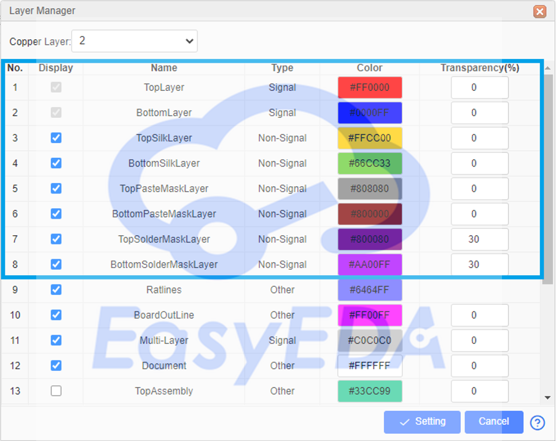

# PCB-Business-card
Printed Circuit Boards (PCB) are used in almost all computers and electronics today since it is the main connection holder of the electronics components through its different layers, but what if we use the PCB layers to create an artful design like a PCB Business Card that shows some personal contact information and demonstrate how talented you are.

Following this guide you will be able to customize the PCB Business card model created by JLCPCB and you could update the model with your personnel information like (name, profession, Email etc..). This project guide has the necessary files to help you step by step to produce your own PCB Business card. Please follow the project steps to get a positive result

# Starting from the bottom
The first and most important information that we must consider is the PCB drawing layers and objects since it is a key when we design a unicolor PCB.
A PCB has multiple layers and each one of these layers has its own use and importance, for a two copper copper sides PCB we have the following basic layers:
{:height="700px" width="400px"}
* TopLayer/BottomLayer: The top side and bottom side of the PCB board, copper layer.
* TopSilkLayer/BottomSilkLayer: Board silkscreen, screen printing is transforming Ink onto a substrate to draw some texts and logos on the board sides.

