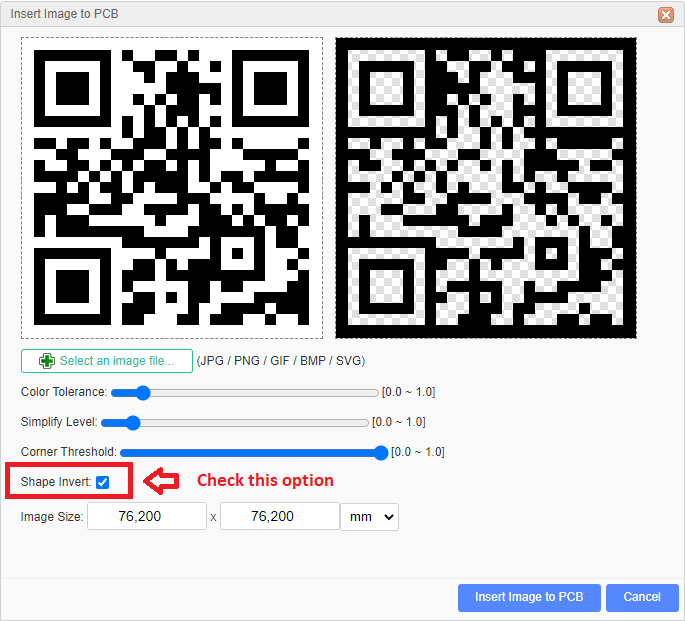
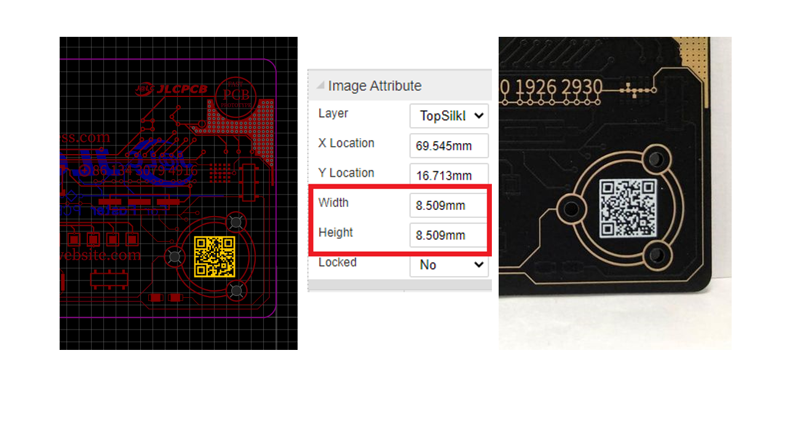

# PCB-Business-card
Printed circuit boards (PCBs) are widely used in almost all computers and electronics today, as they are the main medium for connecting electronic components through its various layers, but what if we use the PCB layers to create a nifty design like a PCB business card that shows personal contact information and demonstrates how talented you are.

By following this guide, you will be able to customize the PCB business card template created by JLCPCB and you will be able to update the template with your personal information such as (name, profession, email, etc.). This project guide contains the files necessary to help you step by step produce your own PCB business card. Please follow the steps of the project to get a positive result. After you finish your design, you can visit us through our website [JLCPCB](http://jlcpcb.com) to enjoy our special offers.

# Starting from the bottom

All along this explanation, we refered to [EasyEDA](http://easyeda.com) as our main design tool.
Before we start the below explanation you can just skip it all and just get through the design that JLCPCB provides through the following [link](https://easyeda.com/JLCPCBsupport/jlcpcb-business-card) which is related to a public EasyEDA project and this way you can just update the design by your personal information.
You can download the design GERBER files to review it by our GERBER Viewer.
Following is the image related to the designed project :

  

  
The first and most important piece of information we need to consider is about the PCB layers and drawing objects, as this is a key when we are designing a single color PCB.
A PCB has multiple layers and each of these layers has its own use and importance, our PCB business card is a two-sided PCB, so we will focus on the following base layers:

  

  
* TopLayer/BottomLayer: The top side and bottom side of the PCB board, copper layer.
* TopSilkLayer/BottomSilkLayer: Board silkscreen, screen printing is transforming Ink on a substrate to draw some texts and logos on the board sides.
* TopSolderMaskLayer/BottomSolderMaskLayer: The top and bottom cover layers of the board are typically green oil, which acts to prevent unwanted welding.

We will create our design based on the management of the layers defined above.

# How to start the PCB design 
As mentioned above, we will refer to [EasyEDA](http://jlcpcb.com) design tool to prepare our PCB design, all what it takes is getting to the EasyEDA designer (step 1) and start a new project that contains a PCB design file (step 2) then it will appear the PCB Design area.

  

Here we will start to prepare the PCB board outline relatively to some real dimensions.
Basically the card has the following width and height sizes:

* Board width: 86.50 mm
* Board height: 53 mm 

right in the PCB design area, select the board outline layer from *layers and objects* palette and select the *track* tool from the pcb tools palette and start drawing the lines of the board outline relatively to the set size

  

Once you have defined the outline of baord, you can start drawing art forms and tracks to make a PCB looking for the pattern, you can start by drawing the traces using the top layer (copper) These lines and shapes will be slightly visible under the solder mask layer once you produce the PCB as it shows in the image below.

  

# Update our JLCPCB design
Please refer to our design if you want to get inspired or if you want to update it with your information.
You will find the following fields :
* Your Name
* Your profession
* Your Email
* Your phone number
* Your website

  

Just double click the text and write your details as it shows the following image :

  

Do the same for all of the required details, and you can even add some additional ones.
The selected layer is the TopLayer (copper), you can write or draw in the bottom layer as well.
In our design, we have uploaded our JLCPCB logo as PNG image and we set it to the bottom copper layer, all what it takes to make the task easier is just hide the TopLayer and keep the bottom layer visible and then move to the PCB tools and select *image* then this will open a new window from where you can browse your computer files to upload the image (please choose an image in PNG format) you can find more details on **how to proparely insert image in PCB editor** through the following link : click [here](https://docs.easyeda.com/en/Import/Import-Image/index.html)  

After handeling the Top and Bottom copper layers, these patterns will be covered by soldermask and it will be not all visibe.
Just remember that the silkscreen (top and bottom) is the ink layer where everything you insert in this layer will be draw on the latest layer of the board which makes it visible.

# Expose the copper layer
If you want to expose the copper that you draw on the top or bottom layer then you need to play a bit with the soldermaskLayer but this time any shape you draw on this layer will be related to a removing of the soldermask from the shape surface.
Backing to our PCB design, we already uploaded the JLCPCB image on the bottom layer means that we will have the image produced on copper layer but it will be covered by the bottomsolderMaskLayer so we need to copy and place the image (duplicate it at the exact same position) now we have the same image at the same exact position with the same size so all what it takes it to set one as bottomLayer and set the other as bottomsolderMaskLayer and this way we will get copper added and solder mask removed which makes this image exposed as it shows the below image.

  

  
You can choose the ENIG surface finish while placing your order, this will add the golden surface looking of your PCB design.
  
# Drop a QR code in the Silkscreen layer

Using links drawn on the PCB is not a kind of good or usefull idea because it will be a bit difficult to rewrite the link in someone's browser, so scannable QR codes is much better idea which can be easily scanned from the PCB, JLCPCB has a good precision in terms of silkscreen drawing which makes the QR code visible and scannable.
All what we need to do is copy the link that you want to add and generate its related QR code, better to be a PNG format. We recommand this [QR code generator](https://www.the-qrcode-generator.com/) to generate the QR code that you need.
Once you get the PNG image related to you QR code just upload it as we did to upload the previous images but this time set it as silkscreen layer. Do not forget to invert the image color as it shows the following image.

  

After uploading the image you need to resize it and we are recommending the following image size as the image below :

  

# Production settings
Once you finish the design update you can move to JLCPCB ordering webpage and upload the GERBER file related to your design and set the following production settings to get the desired results

  

This is all the details related to the Business card that we have prepared for all of you and it is available in a public link in EasyEDA tool through this [link](https://easyeda.com/JLCPCBsupport/jlcpcb-business-card)

**Thank you for reading this guide, hopefully this guide provides full steps to help you to create your own PCB Business card.
If you have any questions please post it in the below comment section.**
