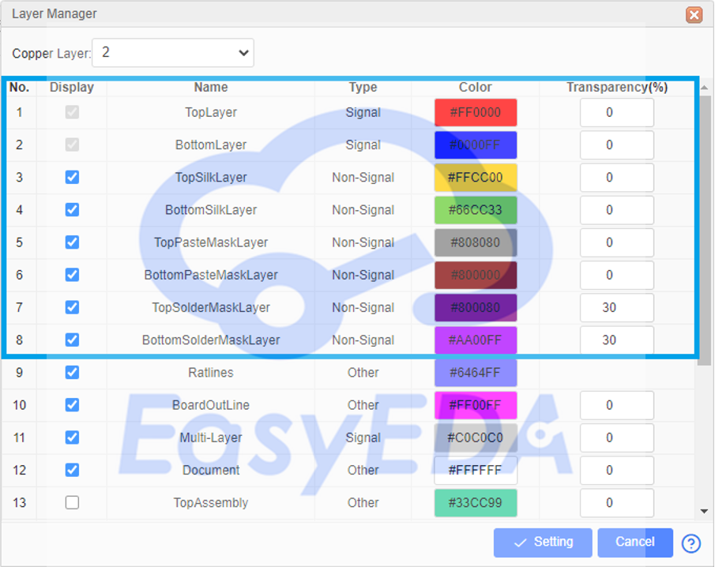
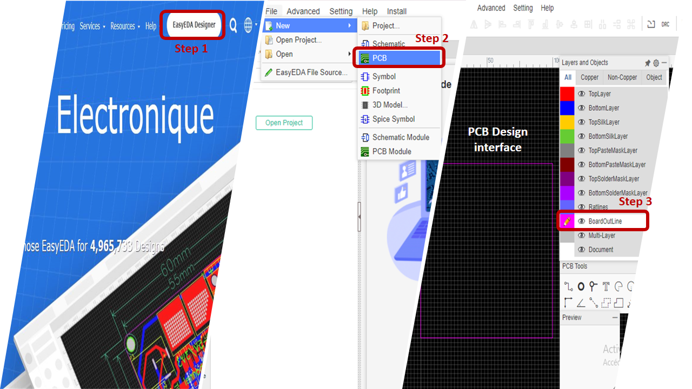

# PCB-Business-card
Printed Circuit Boards (PCB) are used in almost all computers and electronics today since it is the main connection holder of the electronics components through its different layers, but what if we use the PCB layers to create an artful design like a PCB Business Card that shows some personal contact information and demonstrate how talented you are.

Following this guide you will be able to customize the PCB Business card model created by JLCPCB and you could update the model with your personnel information like (name, profession, Email etc..). This project guide has the necessary files to help you step by step to produce your own PCB Business card. Please follow the project steps to get a positive result. After finishing your design, you can visit us through our website [JLCPCB](http://jlcpcb.com) to enjoy our special offers.

# Starting from the bottom
All along this explanation, we refered to [EasyEDA](http://jlcpcb.com) as our main design tool.
The first and most important information that we must consider is the PCB drawing layers and objects since it is a key when we design a unicolor PCB.
A PCB has multiple layers and each one of these layers has its own use and importance, our PCB Business card is a two sides PCB so we will focus on the following basic layers:

  

  
* TopLayer/BottomLayer: The top side and bottom side of the PCB board, copper layer.
* TopSilkLayer/BottomSilkLayer: Board silkscreen, screen printing is transforming Ink onto a substrate to draw some texts and logos on the board sides.
* TopSolderMaskLayer/BottomSolderMaskLayer: The top and bottom cover layers of the board are typically green oil, which acts to prevent unwanted welding.

We will create our design based on the handeling of the defined above layers 

# How to start the PCB design 
As mentioned above, we will refer to [EasyEDA](http://jlcpcb.com) design tool to prepare our PCB design, all what it takes is getting to the EasyEDA designer (step 1) and start a new project that contains a PCB design file (step 2) than it will appear the PCB Design area.

  

Here we will start to prerape the PCB board outline relatively to some real dimensions.
Basically the card has the following width and height sizes:
* Board width: 86.50 mm
* Board height: 53 mm 
right in the PCB design area, select the board outline layer from **layers and objects** palet and select the **track** tool from the pcb tools and start drawing the lines of the board outline relatively to the set size

